04-14-2026
I started the project today with the intention of making a quick breakout for the pcf8563 RTC. I was planning to use this in other projects (such as a bigger RPI hat and a clock), so I wanted to make a quick breakout board to test my layout and see how it works. Today, I spent roughly 3hrs on the project, from creating it, reading the datasheet for the pcf8563 (I had already read a portion of it before), and then designing the layout. The RTC has one internal capacitor for the 32.768kHz crystal, and one external capacitor for the 32.768kHz crystal. My overall goal for this board is to make it as small as possible and cheap with JLC basic assembly. I mostly choose the RTC becuase it is a basic component.
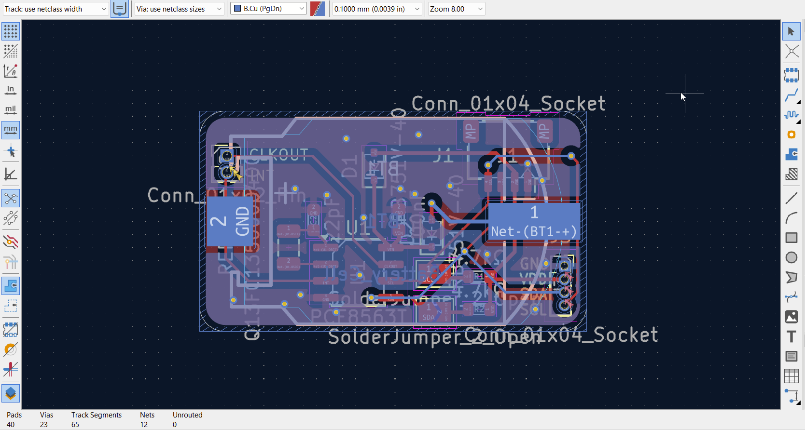
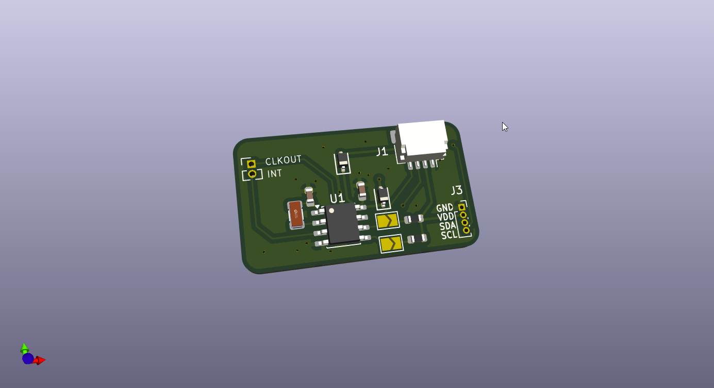
Total hours spent: 3

04-15-2026
I tried to make the layout a bit more compact, and also added a few more components to the board. I originally planned this to be only QWIIC compatible with a battery holder and RTC, but I figured I could attach more components to the board if I wanted to. Since it's I2C, I first decided to add a temp sensor (SHT41). Although not on JLC, I can just buy a breakout from aliexpress for ~$2 and desolder with my reflow plate, which should be fairly doable if I'm careful. I can alo just exclude it if I want. I also decided to add an optional status LED (solder jumper); low power red LED.
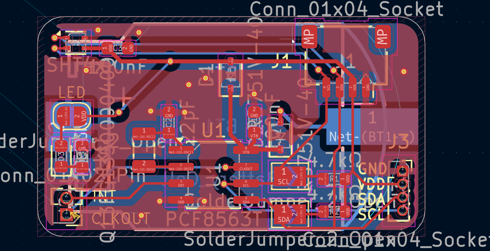

I later decided to turn the jumper into a 3 terminal jumper and give an option for manual control with a breakout pin (either jump b/t VCC or LED pin or none).
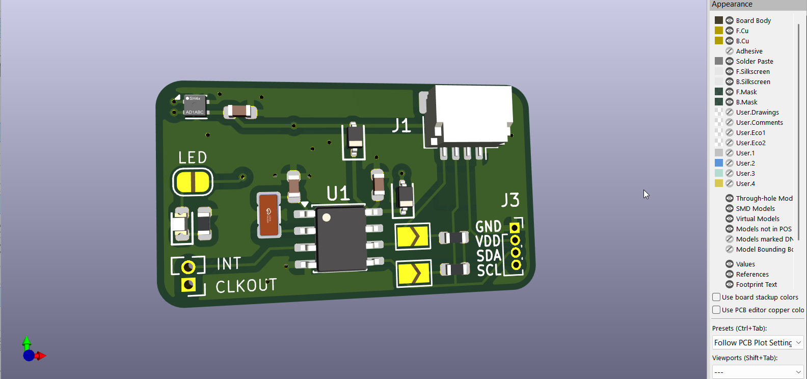

Total hours spent: 1

04-17-2026
I decided to switch to smaller solder jumpers. I modified a sparkfun board recently and decided to take those solder jumper footprints and modify them for my board. I also changed the layout a bit for better routing. (screenshot is before fixing routing)
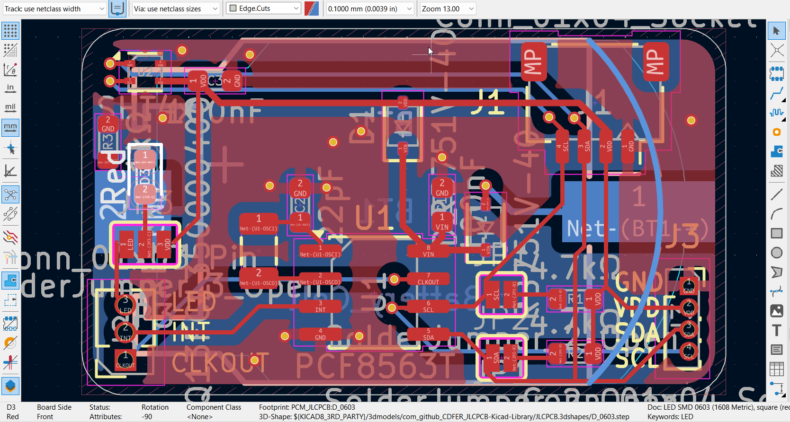
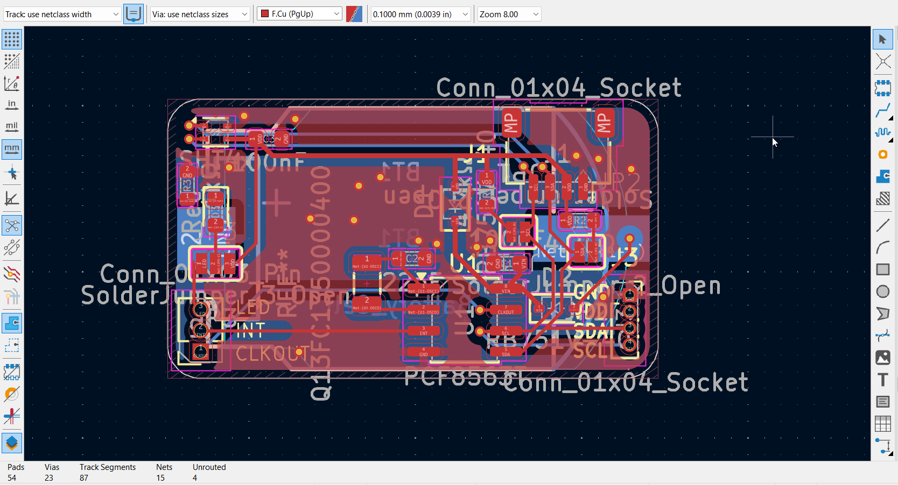
(yes I fixed the routing later)
Total hours spent: 1

04-27-2026
Finally post-exams and I wanted to change a bunch of the overall concept of the board. I want to eventually make a SlimeVR tracker, which is basically a NRF microcontroller, IMU, and magnetometer for full-body tracking. Although I don't have VR, I thought it could be a cool project. Commonly, the LSM6DSV is used for the IMU (since ICM45686 is not widely available anymore due to shortages), and QMC6309 for the magnetometer. However, I wanted to run my board at 1.8V for power efficiency, and the QMC6309 does not work at 1.8V ranges. I decided to use the LIS2MDL for the magnetometer instead, since it has better accuracy and can work at 1.8V power and logic. I spent some time organizing the schematic after adding the layout in and started routing. (This also meant making VDD 1.8V, which was supported by the RTC and SHT41 too).
Turns out, it was a lot more painful than initially expected. I had to change a lot of the layout to accommodate the new components. Below is my first attempt at routing.
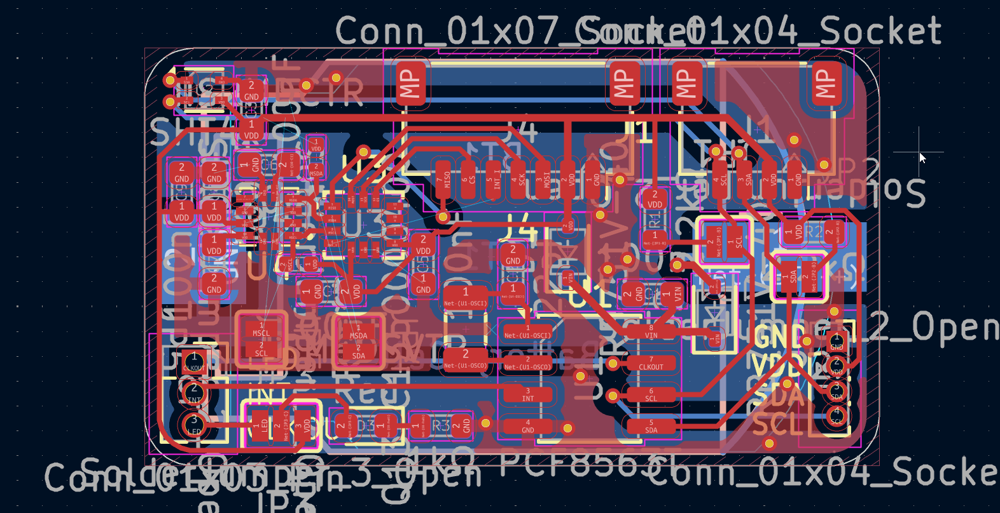
After realziing that this isn't ideal, I tried moving the magnetometer downwards, but this still wasn't ideal (messy routing).
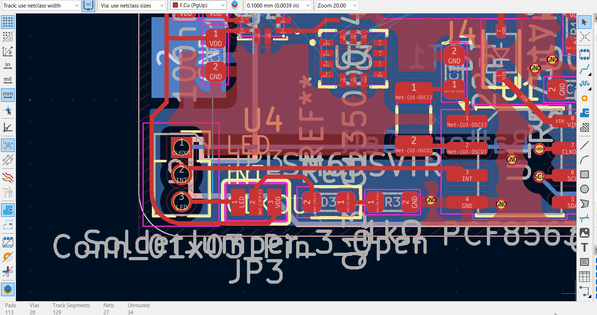
I had a lot of VCC traces going all over and my ground plane on the top layer almost didn't exist becuase of all the traces. Therefore, the only logical option was to switch to a 4-layer board. 

Total hours spent: 2.5

04-28-2026
I still had to redo some of the routing since I now had a power and ground plane. This was my first time doing a 4 layer PCB, so I had to spend some time setting up the layers. My routing process (kinda) is below.
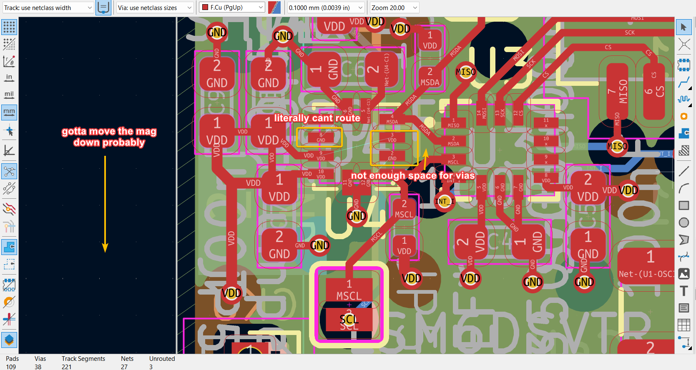
I eventually got something I was satisified with, and send it to someone to review. One thing I wasn't sure of is whether it was a batter practice to route nearby grounds together, or to put a via to each to the ground plane. 
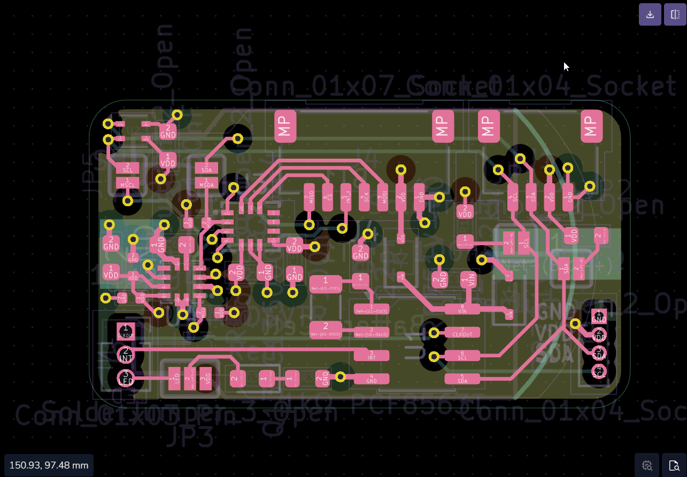

HOWEVER, right after I finished and tried to upload to JLC to see the PCBA price, I found out that the magnetometer I was using (LIS2MDL) was only available for standard assembly, which brought the total cost of 2 boards to ~$115 including shipping. Since this was kinda diabolical and not what I had planned, I contemplated for a bit. I searched JLC parts for magnetometers that were available for economic assembly, and the QMC6309 was pretty much the only option. I had to switch to the QMC6309 for the magnetometer. But, I wanted it to still be compatible at 1.8V, so I then decided to add a level shifter, input for VBAT, and a 3.3V LDO (all of which are basic components so have very little cost). I decided to switch over the schematic and do the layout tomorrow. 

Total hours spent: 2.5

04-29-2026
I first cleaned up the schematic from yesterday and then began working on the layout.
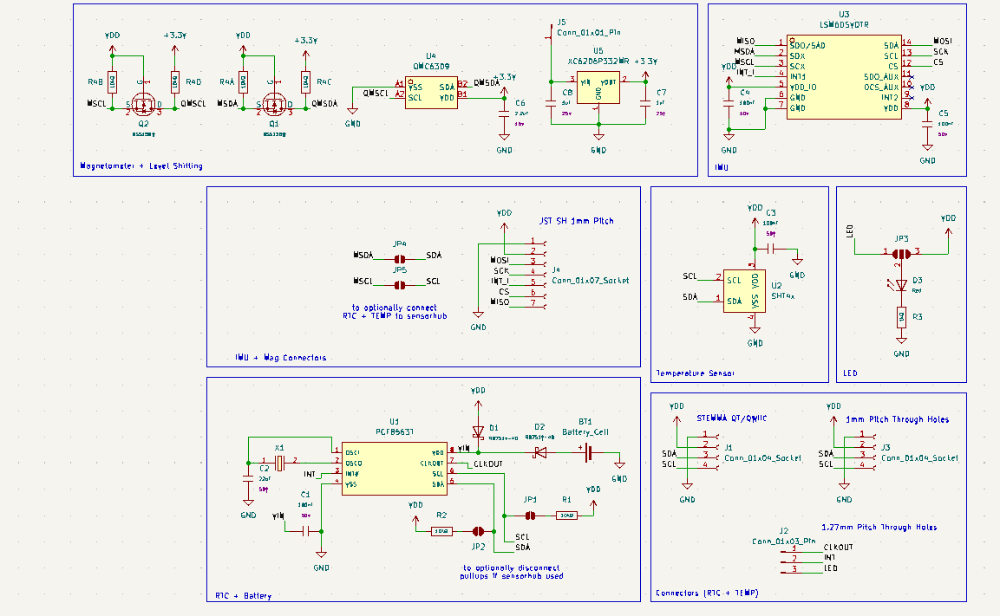

What I had to add, I spent quite a bit of time arranging items on the board since it was quite cramped. I also had to move the magnetometer downwards to make room for the level shifter and LDO.
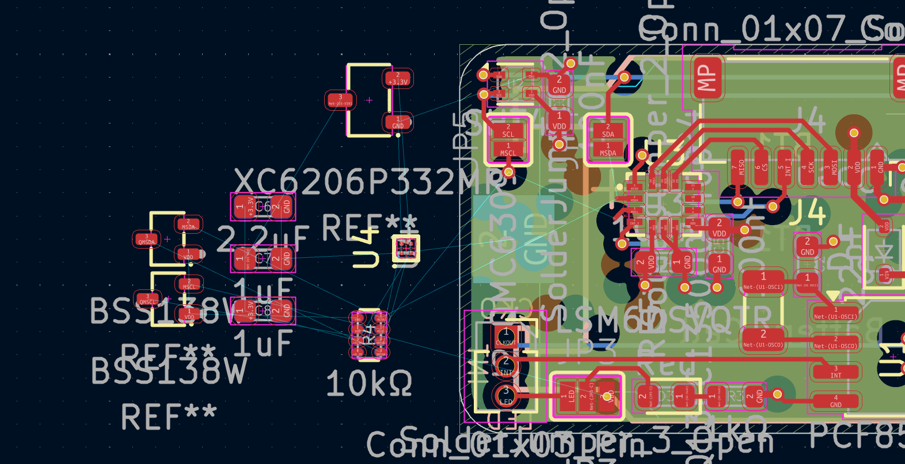

I had so much trouble in fact that I changed all the passives except the 2.2uF cap on the magnetometer to 0402, which finally cleared up enough space. Other than minor silkscreen conflicts, DRC was fine. I just have to get someone to review it, make adjustments, and I should be done.
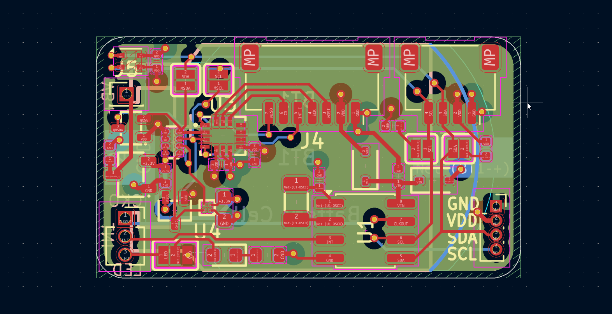
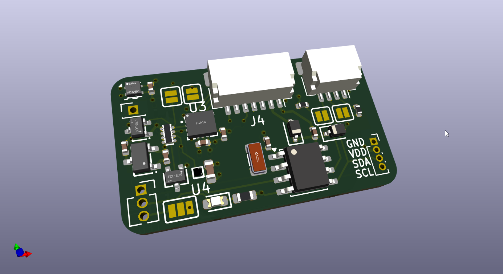

Total hours spent: 2.5
